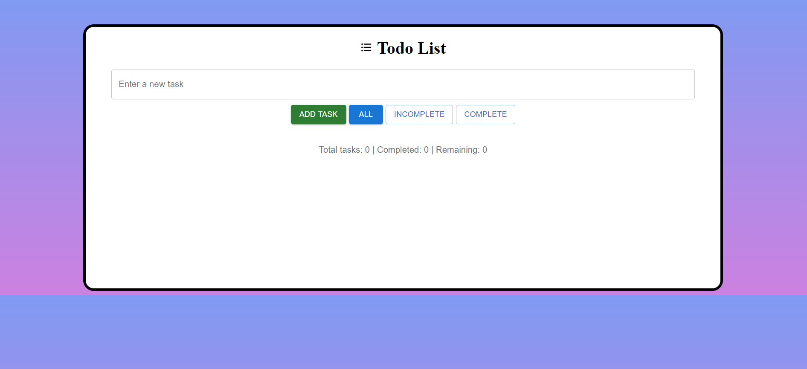

# Todo List App

Todo list application built with React. Allows users to add, delete, and mark tasks as complete/incomplete. Users can also filter tasks based on their completion status.

#### Live Deployment : <a href="https://todo-list-phi-jade.vercel.app/" target="_blank">https://todo-list-phi-jade.vercel.app/</a>

## Features

- Add new tasks
- Mark tasks as complete/incomplete
- Delete tasks
- Filter tasks by completion status
- Persist tasks in local storage

## Technologies Used

- React
- Material-UI

## Installation

1. Clone the repository:
```bash
git clone https://github.com/VKspyder2003/todo-list
```

2. Navigate into the project directory:
```bash 
cd todo-list
```

3. Install dependencies:
```bash
npm install
```

4. Start the development server:
```bash
npm start
```
## How to use

1. Enter a new task in the input field and click "Add Task" to add it to the list.

2. Click on a task to mark it as complete/incomplete.

3. Click the delete icon next to a task to delete it.

4. Use the filter buttons to filter tasks based on their completion status.

